# ☕ CoffeeCraft

> A production-grade iOS coffee shop ordering app built with **SwiftUI** and **Firebase**.

CoffeeCraft serves two distinct roles from a single codebase — **Customer** and **Manager** — with real-time order tracking, live delivery on a map, an in-app wallet, loyalty cards, verified reviews, and a full admin analytics dashboard.


---

## Table of Contents

- [Overview](#overview)
- [Screenshots](#screenshots)
- [Tech Stack](#tech-stack)
- [Architecture at a Glance](#architecture-at-a-glance) — *project diagrams*
  - [System Architecture](#system-architecture)
  - [Project / Module Map](#project--module-map)
  - [Dependency Injection](#dependency-injection)
  - [Order & Delivery Lifecycle](#order--delivery-lifecycle)
- [Architecture](#architecture)
- [Project Structure](#project-structure)
- [Module Breakdown](#module-breakdown)
- [Key Data Models](#key-data-models)
- [Firestore Collections](#firestore-collections)
- [Theme System](#theme-system)
- [Navigation Flow](#navigation-flow)
- [Custom UI Components](#custom-ui-components)
- [Environment Setup](#environment-setup)
- [Running the App](#running-the-app)
- [Creating Test Accounts](#creating-test-accounts)
- [Contributing](#contributing)

---

## Overview

CoffeeCraft is a full-featured coffee shop ordering app demonstrating real-world iOS development practices. Customers can browse the menu, customize drinks, pay with an in-app wallet, track orders in real time, write verified reviews, and manage loyalty cards. Managers have a separate experience for handling orders, managing products, moderating reviews, and viewing sales analytics.

---

## Screenshots

### Customer App

**Onboarding & Authentication**

| Login | Sign Up | Reset Password | Splash / Loading |
|:---:|:---:|:---:|:---:|
|  |  |  | 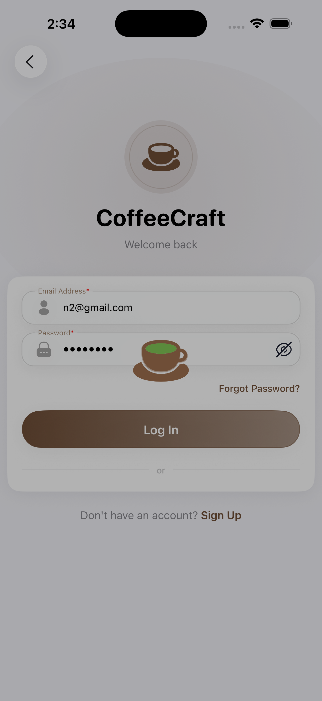 |

**Home & Menu**

| Home | Menu | Search | Product Detail |
|:---:|:---:|:---:|:---:|
| 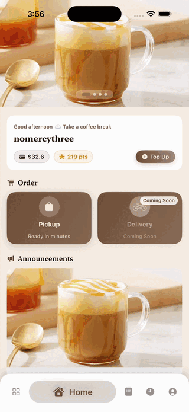 |  | 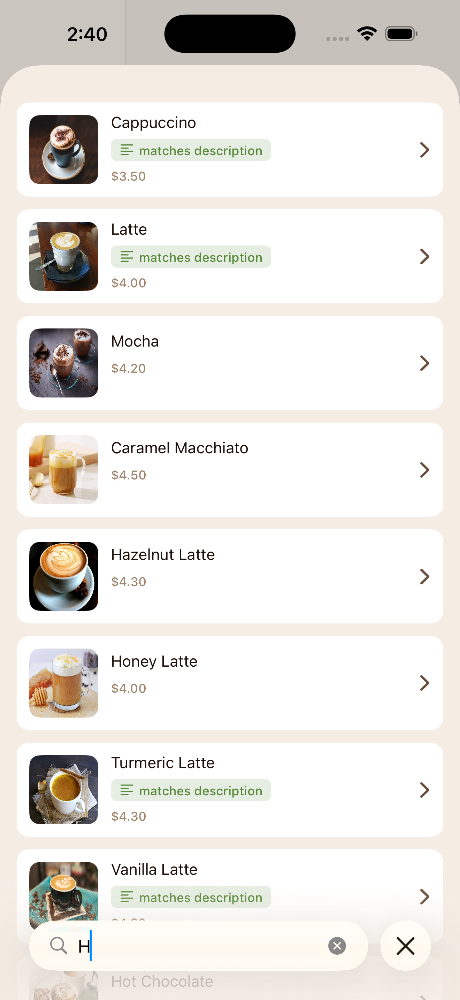 | 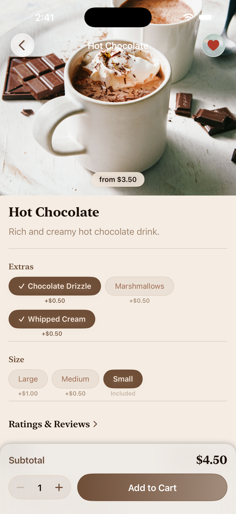 |

**Ordering & Checkout**

| Pickup / Delivery | Store Selection | Cart | Payment Method |
|:---:|:---:|:---:|:---:|
| 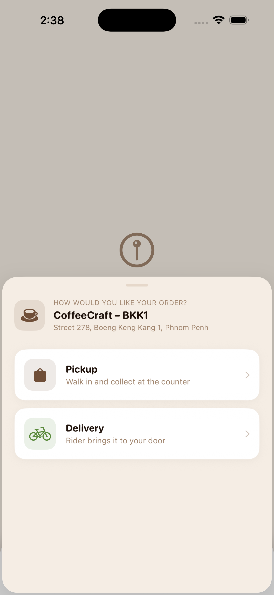 |  | 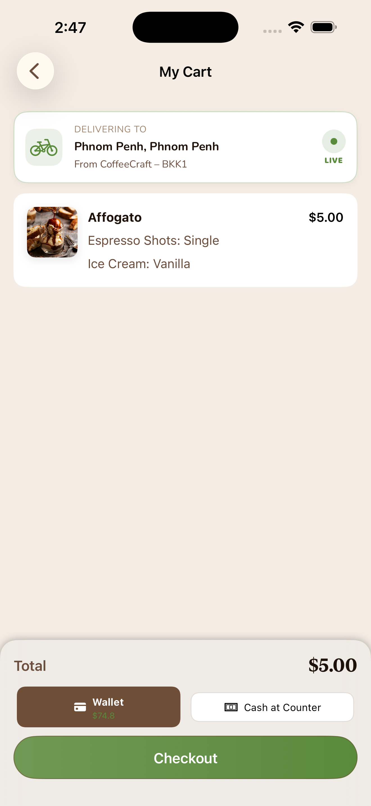 |  |

**Orders & Live Delivery**

| Orders | Order Detail | Live Delivery | Reviews & Ratings |
|:---:|:---:|:---:|:---:|
| 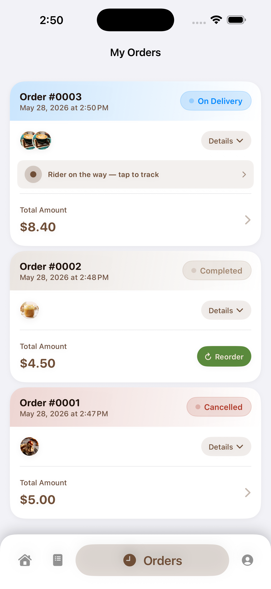 | 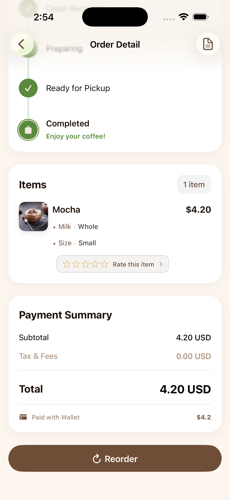 |  | 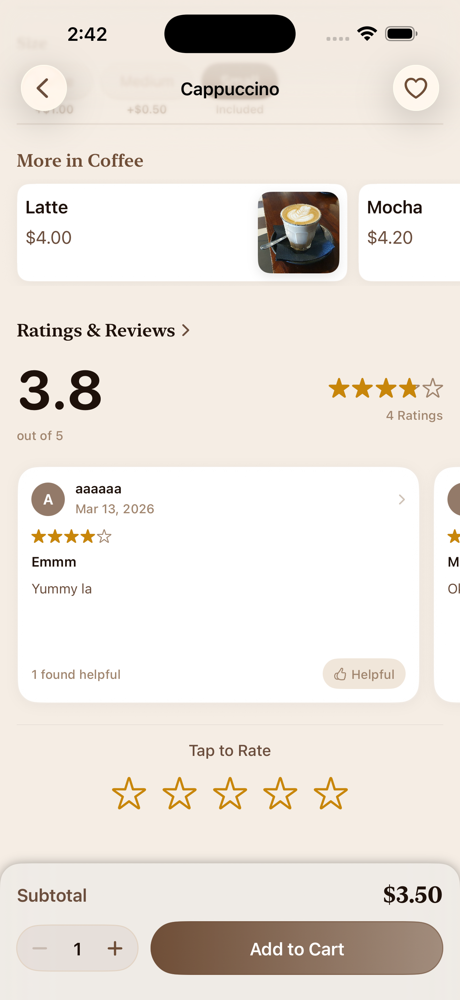 |

**Branches, Wallet & Loyalty**

| Find a Branch | Branch Info | Wallet | Top Up |
|:---:|:---:|:---:|:---:|
| 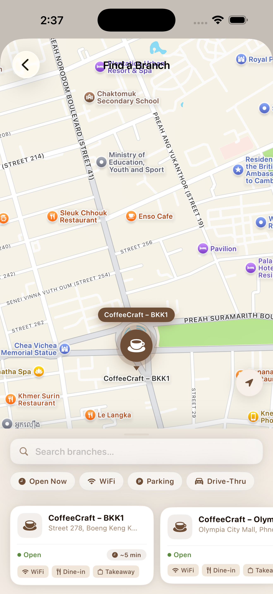 | 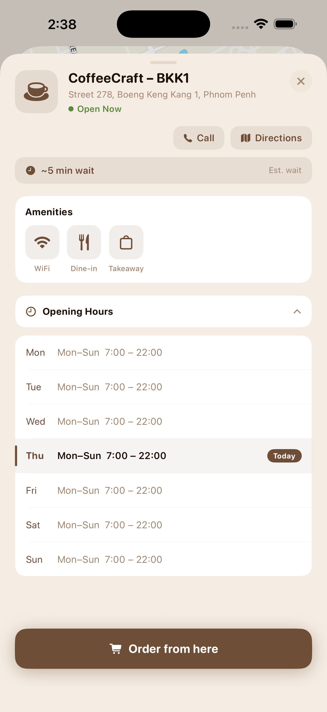 | 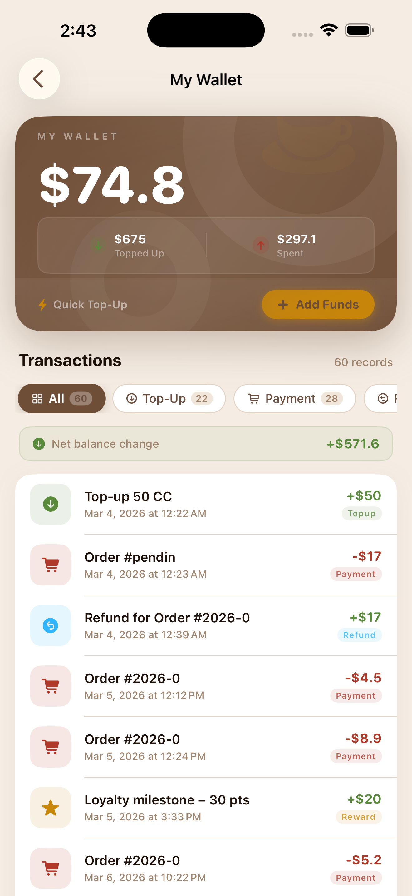 | 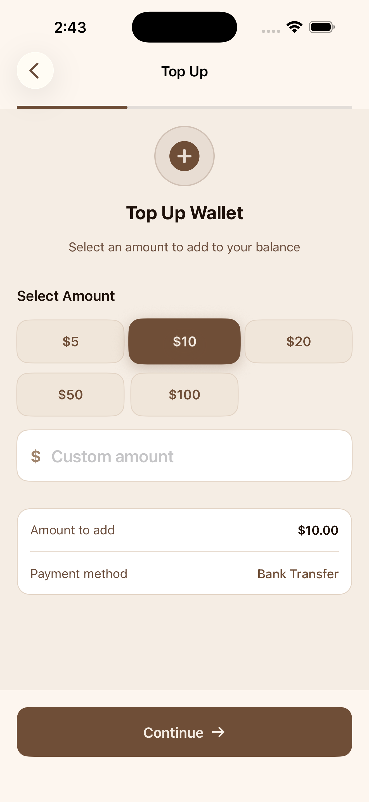 |

**Account & Appearance**

| Account | Edit Profile | Shared Loyalty Cards | Settings | Color Palettes |
|:---:|:---:|:---:|:---:|:---:|
| 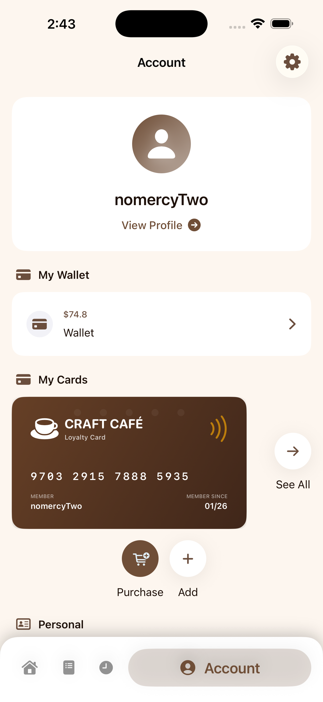 |  | 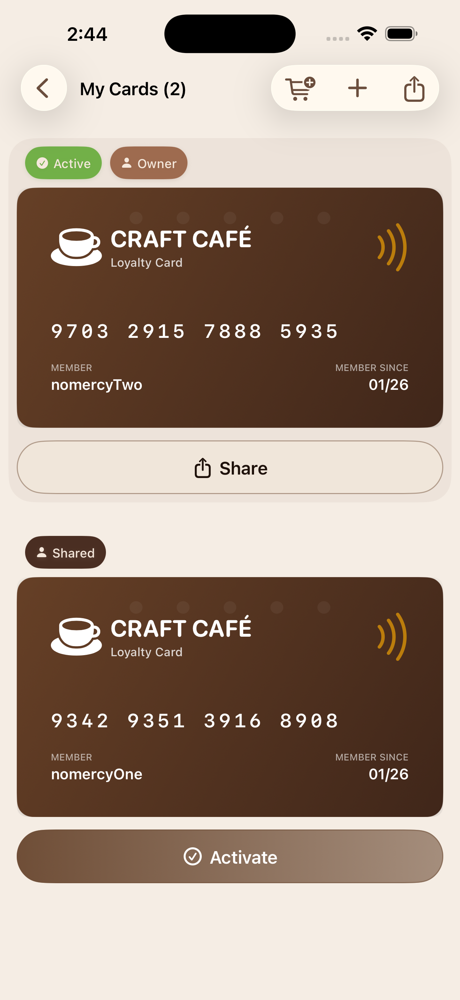 | 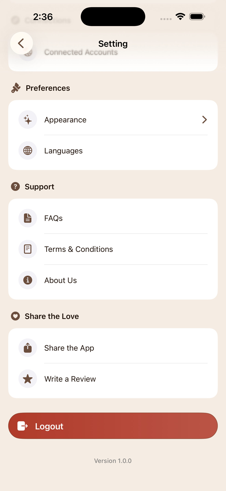 |  |

### Manager / Admin Dashboard

**Sales & Product Analytics**

| Sales Analytics | Rating vs. Sales | Best Sellers | Product Performance |
|:---:|:---:|:---:|:---:|
|  |  | 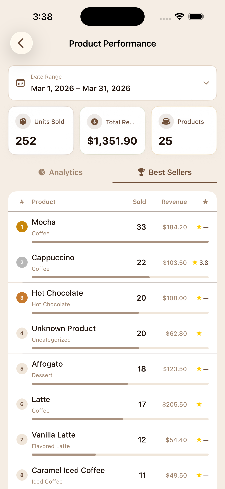 | 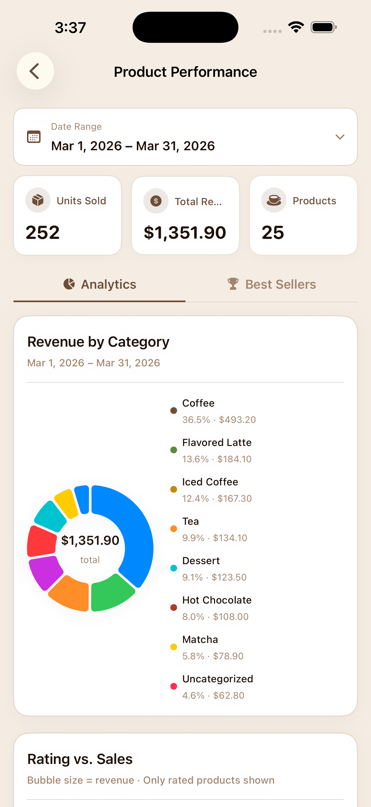 |

**Order Analytics & Operations**

| Order Funnel | Order History | Ordering Hours | Inbox |
|:---:|:---:|:---:|:---:|
| 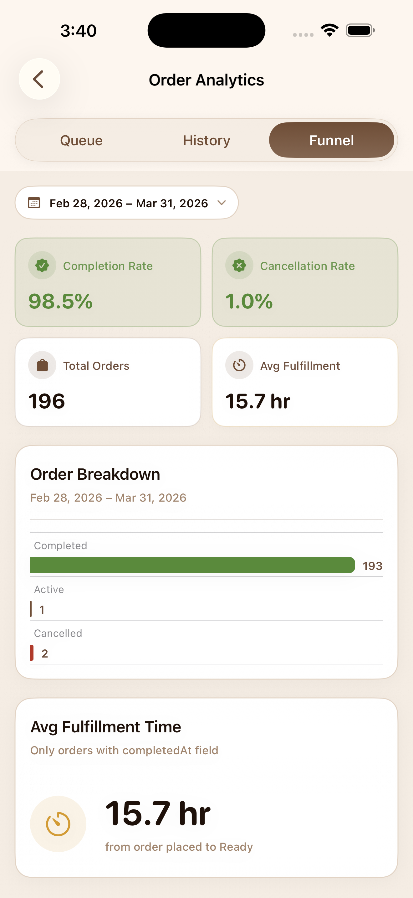 |  | 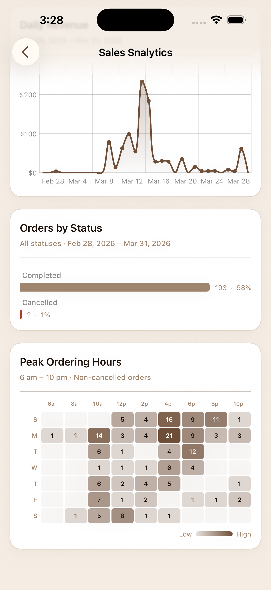 |  |

**Moderation & Users**

| Review Moderation | Users List | User Detail |
|:---:|:---:|:---:|
| 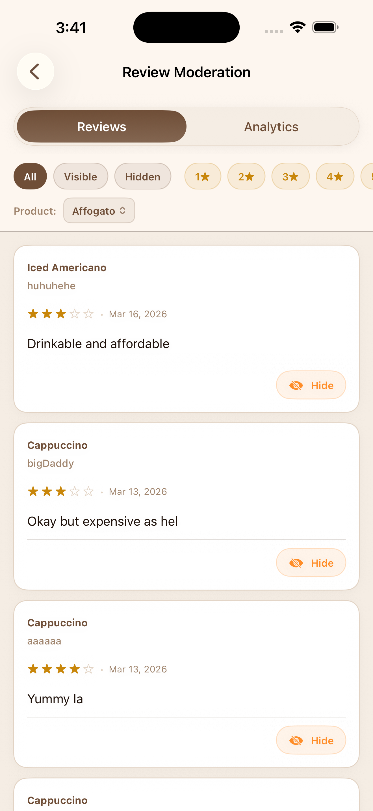 |  |  |

---

## Tech Stack

| Layer | Technology |
|---|---|
| UI Framework | SwiftUI (iOS 17+) |
| Language | Swift 5.9+ |
| Backend | Firebase (Auth, Firestore, Cloud Messaging, Crashlytics, Analytics) |
| Database | Cloud Firestore |
| Authentication | Firebase Auth (Email/Password) |
| Push Notifications | Firebase Cloud Messaging (FCM) |
| Maps | MapKit + CoreLocation |
| Minimum iOS | 17.0 |
| Xcode | 15+ |

---

## Architecture at a Glance

A complete map of how CoffeeCraft fits together — render-friendly Mermaid diagrams you can read top-to-bottom. (GitHub renders these automatically.)

### System Architecture

Every layer depends only on the one below it. Views render state, ViewModels own state, Services/Repositories speak to Firebase through protocols, and Firebase is the source of truth.

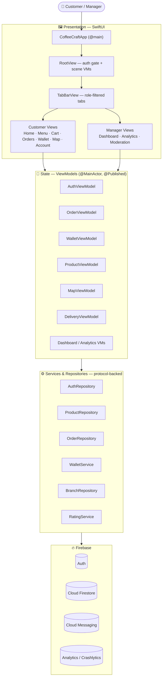
```mermaid
flowchart TD
    User(["👤 Customer / Manager"]) --> APP

    subgraph Presentation["🖼️ Presentation — SwiftUI"]
        APP["CoffeeCraftApp (@main)"]
        ROOT["RootView — auth gate + scene VMs"]
        TAB["TabBarView — role-filtered tabs"]
        CUST["Customer Views<br/>Home · Menu · Cart · Orders · Wallet · Map · Account"]
        MGR["Manager Views<br/>Dashboard · Analytics · Moderation"]
        APP --> ROOT --> TAB
        TAB --> CUST
        TAB --> MGR
    end

    subgraph State["🧠 State — ViewModels (@MainActor, @Published)"]
        AUTHVM[AuthViewModel]
        ORDERVM[OrderViewModel]
        WALLETVM[WalletViewModel]
        PRODVM[ProductViewModel]
        MAPVM[MapViewModel]
        DELVM[DeliveryViewModel]
        ADMINVM[Dashboard / Analytics VMs]
    end

    subgraph Domain["⚙️ Services & Repositories — protocol-backed"]
        AUTHREPO[AuthRepository]
        PRODREPO[ProductRepository]
        ORDERREPO[OrderRepository]
        WALLETSVC[WalletService]
        BRANCHREPO[BranchRepository]
        RATINGSVC[RatingService]
    end

    subgraph Backend["🔥 Firebase"]
        AUTH[(Auth)]
        FS[(Cloud Firestore)]
        FCM[(Cloud Messaging)]
        OBS[(Analytics / Crashlytics)]
    end

    CUST --> State
    MGR --> State
    State --> Domain
    Domain --> Backend
```

### Project / Module Map

Feature modules live in `CoffeeCraft/Module/`. Some are shared by all roles, others are gated by `UserRole`.

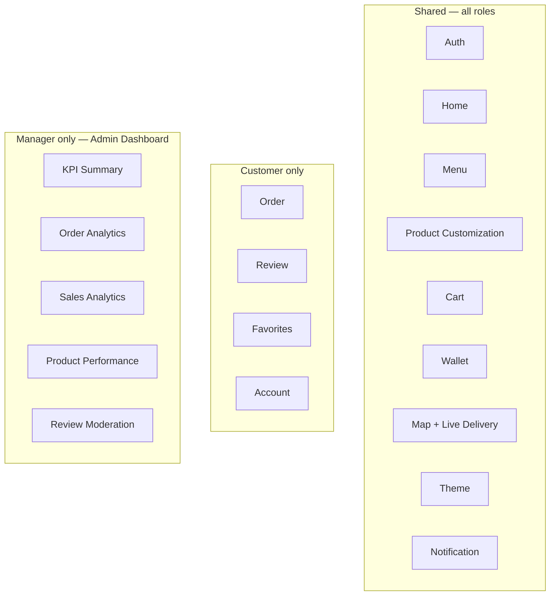
```mermaid
flowchart TB
    subgraph Shared["Shared — all roles"]
        Auth
        Home
        Menu
        Customize["Product Customization"]
        Cart
        Wallet
        MapMod["Map + Live Delivery"]
        Theme
        Notification
    end

    subgraph CustomerOnly["Customer only"]
        Order
        Review
        Favorites
        Account
    end

    subgraph ManagerOnly["Manager only — Admin Dashboard"]
        Summary["KPI Summary"]
        OrderAnalytics["Order Analytics"]
        SalesAnalytics["Sales Analytics"]
        ProductPerf["Product Performance"]
        Moderation["Review Moderation"]
    end
```

### Dependency Injection

Global singletons are injected once from `CoffeeCraftApp` via `@EnvironmentObject`; scene state is created in `RootView`; a few managers are accessed directly.

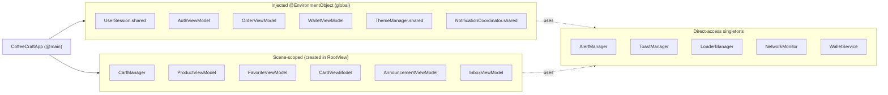
```mermaid
flowchart LR
    APP["CoffeeCraftApp (@main)"]

    subgraph Global["Injected @EnvironmentObject (global)"]
        US[UserSession.shared]
        AVM[AuthViewModel]
        OVM[OrderViewModel]
        WVM[WalletViewModel]
        TM[ThemeManager.shared]
        NC[NotificationCoordinator.shared]
    end

    subgraph Scene["Scene-scoped (created in RootView)"]
        CART[CartManager]
        PVM[ProductViewModel]
        FVM[FavoriteViewModel]
        CVM[CardViewModel]
        ANN[AnnouncementViewModel]
        IVM[InboxViewModel]
    end

    subgraph Direct["Direct-access singletons"]
        AM[AlertManager]
        TOAST[ToastManager]
        LOAD[LoaderManager]
        NM[NetworkMonitor]
        WS[WalletService]
    end

    APP --> Global
    APP --> Scene
    Global -.uses.-> Direct
    Scene -.uses.-> Direct
```

### Order & Delivery Lifecycle

An order moves through a fixed status flow; once a delivery order is dispatched, a separate live-tracking lifecycle drives the map (powered by `DeliveryViewModel` + Firestore `deliveries/`).

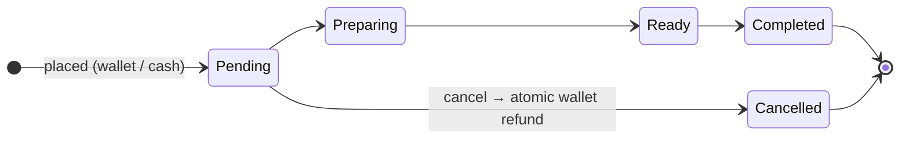
```mermaid
stateDiagram-v2
    direction LR
    [*] --> Pending: placed (wallet / cash)
    Pending --> Preparing
    Preparing --> Ready
    Ready --> Completed
    Pending --> Cancelled: cancel → atomic wallet refund
    Completed --> [*]
    Cancelled --> [*]
```


```mermaid
stateDiagram-v2
    direction LR
    [*] --> orderPlaced: Preparing your order
    orderPlaced --> riderAssigned: Rider heading to branch
    riderAssigned --> pickedUp: Rider picked up order
    pickedUp --> enRoute: On the way to you
    enRoute --> arriving: Almost there
    arriving --> delivered: Delivered
    delivered --> [*]
```

---

## Architecture

CoffeeCraft follows MVVM with a Repository layer. ViewModels never import Firebase directly — they depend only on repository protocols.

```
View (SwiftUI)
  └─ ViewModel (@MainActor, @Published state)
       └─ Repository Protocol
            └─ Firebase Repository (Firestore / Firebase Auth)
```

### Dependency Injection

Global state is distributed via `@EnvironmentObject` from `CoffeeCraftApp`. The following objects are injected at the root and accessible throughout the entire view hierarchy:

| Object | Purpose |
|---|---|
| `UserSession.shared` | Current user, role, auth state, Crashlytics identity |
| `AuthViewModel` | Auth lifecycle: sign-in, registration, session restore, password reset |
| `OrderViewModel` | Real-time customer orders with cursor-based pagination |
| `WalletViewModel` | Real-time wallet balance and transaction list |
| `ThemeManager.shared` | Appearance mode and color palette |
| `NotificationCoordinator.shared` | Deep-link routing from push notification taps |

Scene-scoped objects created in `RootView` (not global):

| Object | Purpose |
|---|---|
| `CartManager` | Shopping cart with Firestore sync, one per scene |
| `ProductViewModel` | Product catalog and CRUD |
| `FavoriteViewModel` | Wishlist management |
| `CardViewModel` | Loyalty card management |
| `AnnouncementViewModel` | Home screen announcements |
| `InboxViewModel` | Notification inbox with pagination |

Additional singletons accessed directly (not injected):

| Object | Purpose |
|---|---|
| `AlertManager.shared` | Global modal alerts and error dialogs |
| `ToastManager.shared` | Transient toast notifications |
| `LoaderManager.shared` | Full-screen loading spinner |
| `NetworkMonitor.shared` | Connectivity detection |
| `WalletService.shared` | All atomic wallet mutations (top-up, payment, refund) |

### Repository Pattern

Every domain with Firebase access has:
- A protocol in `CoffeeCraft/Repository/<Domain>/`
- A Firebase implementation in the same folder

Protocols available:

| Protocol | Firebase Implementation |
|---|---|
| `AuthRepositoryProtocol` | `FirebaseAuthRepository` |
| `ProductRepositoryProtocol` | `FirestoreProductRepository` |
| `OrderRepositoryProtocol` | `FirestoreOrderRepository` |
| `WalletRepositoryProtocol` | `FirestoreWalletRepository` |

ViewModels receive a repository via initializer injection, defaulting to the Firebase implementation. Swap the implementation in tests without touching any ViewModel or View code.

### Real-Time Data Strategy

| Strategy | Used For |
|---|---|
| Snapshot listeners | Products, wallet balance, wallet transactions, inbox notifications |
| Cursor-based pagination | Orders (pageSize = 5; the listener covers all loaded pages) |
| `db.runTransaction()` | Wallet top-up, order payment, order cancellation refund — all atomic across multiple documents |

---

## Project Structure

```
CoffeeCraft/
├── Main/
│   └── View/
│       ├── CoffeeCraftApp.swift      # @main entry, all EnvironmentObjects injected here
│       ├── RootView.swift            # Auth gate + tab routing + scene ViewModels
│       ├── TabBarView.swift          # Custom animated tab bar, role-filtered tabs
│       ├── ContentView.swift
│       └── AppDelegate.swift         # FCM setup, push notification delegate
│
├── Module/                           # Feature modules (see Module Breakdown)
│   ├── Auth/
│   ├── Home/
│   ├── Menu/
│   ├── ProductCustomization/
│   ├── Cart/
│   ├── Order/
│   ├── Wallet/
│   ├── Review/
│   ├── Favorites/
│   ├── Map/
│   ├── Account/
│   ├── AdminDashboard/
│   ├── Profile/
│   ├── Notification/
│   ├── Theme/
│   └── Settings/
│
├── Repository/                       # Protocol + Firebase implementations
│   ├── Auth/
│   ├── Product/
│   ├── Order/
│   └── Wallet/
│
├── Custom/                           # 30+ reusable SwiftUI components
│   ├── API_UI_Components/            # AlertManager, ToastManager, LoaderManager, ShimmerView
│   ├── Scroll/                       # CustomRefreshScrollView
│   ├── MaterialTextField.swift
│   ├── AsyncImageCard.swift
│   ├── InfiniteCarousel.swift
│   ├── ChipFlowLayout.swift
│   └── ...
│
├── Extension/
│   ├── Color+Ex.swift                # Semantic color token system
│   ├── Font+Ex.swift                 # Custom font system
│   ├── View+Ex.swift
│   ├── String+Ex.swift
│   └── Double+Ex.swift
│
├── Utilize/
│   ├── UserSession.swift             # Auth + user identity state
│   ├── AppLog.swift                  # Structured logging (use instead of print)
│   ├── AnalyticsService.swift        # Firebase Analytics wrapper
│   ├── PerformanceService.swift      # Firebase Performance wrapper
│   └── Network/
│       └── NetworkMonitor.swift
│
├── Constants/
│   └── FirebaseKeys.swift            # All Firestore collection/field name constants
│
└── docs/
    ├── firestore-schema.md           # Full Firestore schema reference
    ├── architecture.md               # MVVM + Repository deep-dive
    ├── theme-system.md               # Theme and color token guide
    ├── navigation.md                 # Navigation flow and deep-link routing
    └── custom-components.md          # Custom UI component catalog
```

---

## Module Breakdown

Each module follows the folder convention `MVVM/Model`, `MVVM/ViewModel`, `View` (or the flat equivalents `Model/`, `ViewModel/`, `View/`).

### Auth

Email/password sign-up, sign-in, and password reset via Firebase Auth. On sign-up the app writes a `users/{uid}` document with name, email, role, and optional profile fields. `AuthViewModel` restores sessions on launch via `Auth.auth().currentUser`.

Key files: `AuthViewModel.swift`, `AuthView.swift`, `FirebaseAuthRepository.swift`

### Home

Landing screen with an infinite banner carousel, announcement cards, and wallet balance shortcut. `AnnouncementViewModel` listens to the `announcements` Firestore collection.

Key files: `HomeView.swift`, `AnnouncementViewModel.swift`, `InfiniteCarousel.swift`

### Menu

Product catalog grouped by category. Supports search by name, category chip filtering, and product detail with customization. Managers see add/edit/delete controls. `ProductViewModel` uses a snapshot listener so product availability updates in real time.

Key files: `MenuView.swift`, `ProductViewModel.swift`, `FirestoreProductRepository.swift`

### ProductCustomization

Dynamic drink customization sheet. `Product.customizations` is a `[String: [String: Double]]` map (e.g. `"Size" → ["Small": 0.0, "Large": 1.0]`). The sheet renders one selection group per key. Price delta is computed in `CartItem.totalPrice`.

Key files: `CustomizationView.swift`, `CustomizationOption.swift`

### Cart

Shopping cart backed by a Firestore document at `carts/{userId}`. `CartManager` encodes the full `CartItem` (including the nested `Product` snapshot) via `Firestore.Encoder` so the cart survives app restarts.

Key files: `CartManager.swift`, `CartItem.swift`

### Order

Customer-facing order list with real-time status updates and cursor-based pagination. Each order card links to a detail view showing a status timeline, pricing breakdown, and reorder button. Orders in `Pending` status can be cancelled, which triggers an atomic wallet refund. Managers see a separate `AdminOrdersView` to update order status and send FCM notifications to the customer.

Order status flow: `Pending` → `Preparing` → `Ready` → `Completed`

Key files: `OrderViewModel.swift`, `AdminOrdersViewModel.swift`, `OrderService.swift`, `Order.swift`, `OrderDetailView.swift`, `OrderReceiptView.swift`

### Wallet

In-app wallet with balance display and scrollable transaction history. Top-up is a three-step flow: Amount → Bank → Checkout. All balance mutations (top-up, payment, refund) go through `WalletService.shared` using Firestore transactions to keep the `wallets` balance and `wallet_transactions` ledger in sync atomically.

Key files: `WalletViewModel.swift`, `WalletService.swift`, `Wallet.swift`, `WalletTransaction.swift`

### Review

Proof-of-purchase verified reviews. Before a customer can rate a product, the app queries `orders` for a completed order containing that product's ID. Star ratings live at `products/{id}/ratings/{userId}` (one per user per product). Review text lives at `products/{id}/reviews/{autoId}`. `RatingService` runs a Firestore transaction on submit to atomically update `avgRating`, `ratingCount`, and `ratingDistribution` on the product document.

Key files: `RatingService.swift`, `ReviewViewModel.swift`, `UserRating.swift`, `Review.swift`

### Favorites

Wishlist backed by `users/{uid}/favorites/{productId}` subcollection documents. `FavoriteViewModel` loads favorites on launch and keeps an in-memory set for O(1) toggle checks.

Key files: `FavoriteViewModel.swift`, `FavoriteItem.swift`

### Map & Live Delivery

Store locator built on MapKit + CoreLocation showing every branch as an annotated pin, with search, filter chips, distance sorting, and an "Order from here" handoff into the menu. The branch detail sheet shows hours, amenities, staff-posted wait time, and an Apple Maps directions button. `OrderEnvironment.shared` is the cross-module hub that holds the selected branch, fulfillment mode (pickup vs. delivery), and all active delivery sessions.

The **Delivery** submodule (`Map/Delivery/`) drives real-time rider tracking: when a delivery order reaches `OnDelivery`, `DeliveryViewModel` starts a route simulation (`DeliverySimulator`), animates a rider annotation along an `MKPolyline`, computes a live ETA, and persists the rider's last position to Firestore `deliveries/{orderId}`. `DeliveryRestoreService` resumes an in-progress delivery at the correct mid-route position after an app relaunch, and multiple concurrent deliveries are tracked independently (keyed by `orderId`).

Key files: `MapView.swift`, `MapViewModel.swift`, `OrderEnvironment.swift`, `Branch.swift`, `BranchRepository.swift`, `DeliveryViewModel.swift`, `DeliverySession.swift`, `DeliveryStatus.swift`, `DeliveryRestoreService.swift`, `DeliveryMapView.swift`

### Account

Profile hub with sections for wallet balance, loyalty cards, inbox, order history, profile editing, and appearance settings. The inbox fetches paginated notifications from the `users/{uid}/notifications` subcollection and categorizes them into typed row views (order status, wallet, announcement, promotion, reward).

Key files: `AccountView.swift`, `InboxViewModel.swift`, `CardViewModel.swift`

### AdminDashboard

Manager-only tab with four sub-sections:
- **Dashboard Summary** — KPI cards (revenue today/week/month, active orders, new customers) and a live order feed
- **Order Analytics** — real-time order queue with status filter
- **Product Performance** — best sellers and analytics charts
- **Sales Analytics** — revenue over time and peak-hour heatmap
- **Review Moderation** — hide/unhide reviews per product

Key files: `DashboardHomeViewModel.swift`, `OrderAnalyticsViewModel.swift`, `ProductPerformanceViewModel.swift`, `SalesAnalyticsViewModel.swift`, `ReviewModerationViewModel.swift`

### Theme

Manages appearance mode (system/light/dark) and color palette (Brown, Strawberry, Matcha, Oreo) persisted via `@AppStorage`. See `docs/theme-system.md` for the full token reference.

Key files: `ThemeManager.swift`, `AppTheme.swift`, `AppearanceSettingsView.swift`

### Notification

`AppDelegate` registers for push notifications and forwards FCM tokens to Firestore at `users/{uid}/fcmTokens/{deviceId}`. `NotificationCoordinator` receives tap callbacks and sets a flag that `RootView` observes to navigate to the Orders tab.

Key files: `AppDelegate.swift`, `NotificationCoordinator.swift`

---

## Key Data Models

### User

```swift
struct User: Identifiable, Codable, Equatable {
    var id: String
    var name: String
    var email: String
    var role: UserRole          // .customer | .manager
    var phoneNumber: String?
    var gender: String?
    var dateOfBirth: Date?
    var city: String?
}
```

### Product

```swift
struct Product: Identifiable, Codable {
    var id: String
    var name: String
    var description: String
    var price: Double
    var imageURL: String
    var category: String
    var available: Bool
    var customizations: [String: [String: Double]]?  // e.g. "Size" → ["Large": 1.0]
    var avgRating: Double?
    var ratingCount: Int?
    var ratingDistribution: [String: Int]?           // keys "1".."5"
}
```

### CartItem

```swift
struct CartItem: Identifiable, Codable {
    let id: UUID
    let product: Product          // full snapshot at add-to-cart time
    let selections: [String: String]  // e.g. ["Size": "Large"]
    let extras: [String]
    var quantity: Int
    var totalPrice: Double        // computed from base price + option deltas * quantity
}
```

### Order

Stored in `orders/{autoId}`. Key fields:

| Field | Type | Notes |
|---|---|---|
| `userId` | String | Firebase Auth UID |
| `orderId` | Int | Sequential display number |
| `items` | [CartItemData] | Lightweight snapshot — name, price, selections, extras |
| `totalPrice` | Double | |
| `status` | String | "Pending" / "Preparing" / "Ready" / "Completed" |
| `timestamp` | Date | |
| `paymentMethod` | String? | "wallet" or "cash" |
| `walletAmountPaid` | Double? | Wallet amount deducted, used for refund |
| `branchId` | String? | Branch document ID |
| `productIds` | [String]? | Flat list used for proof-of-purchase queries |

### Wallet

```swift
struct Wallet: Identifiable, Codable {
    var id: String?           // = userId
    var balance: Double
    let currency: String      // "USD"
    var totalTopUp: Double
    var totalSpent: Double
    let createdAt: Date
    var updatedAt: Date
}
```

### WalletTransaction

Append-only ledger document. `amount` is positive for credits (top-up, refund, reward) and negative for debits (payment).

| Field | Type | Notes |
|---|---|---|
| `userId` | String | |
| `type` | String | "topup" / "payment" / "refund" / "reward" |
| `amount` | Double | + credit, - debit |
| `balanceBefore` | Double | Snapshot for auditability |
| `balanceAfter` | Double | Snapshot for auditability |
| `description` | String | Human-readable label |
| `referenceId` | String? | orderId for payment/refund types |
| `timestamp` | Date | |

### LoyaltyCard

```swift
struct LoyaltyCard: Identifiable, Codable {
    var id: String?
    let cardNumber: String
    let ownerId: String
    let ownerName: String
    let memberSince: String
    var points: Int
    let createdAt: Date
    var sharedWith: [String]   // array of userIds with shared access
}
```

---

## Firestore Collections

For the full field-level schema with example documents see `CoffeeCraft/CoffeeCraft/CoffeeCraft/docs/firestore-schema.md`.

| Collection | Document ID | Purpose |
|---|---|---|
| `users` | Firebase Auth UID | User profile, role, optional details |
| `products` | Auto ID | Product catalog with customizations and rating aggregates |
| `products/{id}/ratings` | userId | One rating per user per product (proof of purchase, star score) |
| `products/{id}/reviews` | Auto ID | Optional review text linked to a rating |
| `carts` | userId | Active shopping cart (full CartItem snapshots) |
| `orders` | Auto ID | Placed orders with status, items, payment details |
| `wallets` | userId | Wallet balance and lifetime totals |
| `wallet_transactions` | Auto ID | Append-only balance ledger |
| `branches` | Auto ID | Physical store locations with coordinates, hours, amenities, wait time |
| `deliveries` | orderId | Live delivery session: rider position, status, ETA, route endpoints |
| `announcements` | Auto ID | Home screen announcement cards |
| `loyaltyCards` | Auto ID | Loyalty cards, ownership, shared access, points |

---

## Theme System

`ThemeManager.shared` manages two independent settings:

- **Appearance mode** (`AppTheme`): `.system`, `.light`, `.dark` — maps to SwiftUI `ColorScheme`
- **Color palette** (`ColorPalette`): `.brown`, `.strawberry`, `.matcha`, `.oreo`

Both are persisted with `@AppStorage` and survive app restarts.

### Semantic Color Tokens

Always use these tokens instead of raw hex colors or asset catalog names:

| Token | Purpose |
|---|---|
| `Color.bgPrimary` | Main app background |
| `Color.bgSecondary` | Grouped list section background |
| `Color.surfacePrimary` | Card and sheet surfaces |
| `Color.surfaceSub` | Nested rows, chips, tag backgrounds |
| `Color.borderColor` | Dividers, card strokes, input borders |
| `Color.textPrimary` | Body copy and titles |
| `Color.textSecondary` | Subtitles and secondary labels |
| `Color.textMuted` | Placeholders, timestamps, captions |
| `Color.accentPrimary` | Primary CTA buttons, tab highlights, active states |
| `Color.accentGold` | Rewards, points, premium CTAs |

All tokens call `ThemeManager.shared.palette.dynamicColor(...)`, which uses `UIColor(dynamicProvider:)` to handle light/dark switching automatically.

### Palette Re-Render

`CoffeeCraftApp` applies `.id(themeManager.palette.rawValue)` to the root view. This forces a full SwiftUI re-render when the palette changes, ensuring every `Color.accentPrimary` call picks up the new palette. Do not remove this modifier.

See `docs/theme-system.md` for a complete palette and token reference.

---

## Navigation Flow

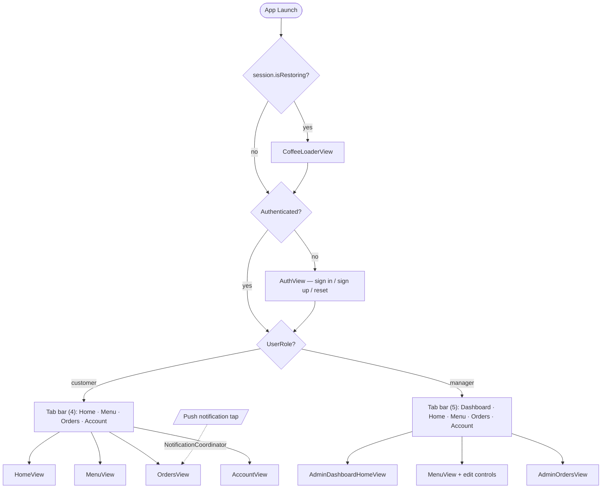
```mermaid
flowchart TD
    Launch([App Launch]) --> Restore{session.isRestoring?}
    Restore -- yes --> Loader[CoffeeLoaderView]
    Restore -- no --> AuthGate{Authenticated?}
    Loader --> AuthGate
    AuthGate -- no --> Login[AuthView — sign in / sign up / reset]
    AuthGate -- yes --> Role{UserRole?}
    Login --> Role

    Role -- customer --> CTabs["Tab bar (4): Home · Menu · Orders · Account"]
    Role -- manager --> MTabs["Tab bar (5): Dashboard · Home · Menu · Orders · Account"]

    CTabs --> Home[HomeView]
    CTabs --> Menu[MenuView]
    CTabs --> Orders[OrdersView]
    CTabs --> Account[AccountView]

    MTabs --> Dash[AdminDashboardHomeView]
    MTabs --> MenuM["MenuView + edit controls"]
    MTabs --> OrdersM[AdminOrdersView]

    Push[/Push notification tap/] -. NotificationCoordinator .-> Orders
```

The `Tab` enum has five cases: `dashboard`, `home`, `menu`, `orders`, `profile`. `Tab.visible(for:)` filters out `.dashboard` for customer role, so the tab bar shows 4 tabs for customers and 5 for managers.

Push notification taps route through `NotificationCoordinator`. When the coordinator sets `shouldNavigateToOrders`, `RootView` switches `selectedTab` to `.orders`.

---

## Custom UI Components

All reusable components live in `CoffeeCraft/Custom/`. Prefer these over building new primitives.

### Input

| Component | Description |
|---|---|
| `MaterialTextField` | Floating-label text field with validation state |
| `CustomTextField1` | Extended field with leading icon |
| `CustomSecureField` | Password field with show/hide toggle |
| `CustomNumberField` | Numeric-only input |

### Selection

| Component | Description |
|---|---|
| `CustomSegmentedControl` | Styled segment picker matching app theme |
| `CustomSingleSelectionView` | Radio-button-style grid for single selection |
| `CustomMultipleSelectionView` | Checkbox-style grid for multi-select |
| `ChipFlowLayout` | Wrapping chip layout for tag/filter lists |
| `PickerSheetView` | Bottom sheet with list picker |

### Media

| Component | Description |
|---|---|
| `AsyncImageCard` | Async image with built-in shimmer skeleton while loading |
| `InfiniteCarousel` | Auto-scrolling banner carousel with manual page control |
| `ShimmerView` | Standalone shimmer/skeleton effect for loading states |
| `WebView` | WKWebView wrapper for in-app web content |

### Feedback

| Component | Description |
|---|---|
| `AlertManager` | Global alert/error dialog system (call `AlertManager.shared.showSuccess(...)`) |
| `ToastManager` | Transient toast notifications (call `ToastManager.shared.show(...)`) |
| `LoaderManager` | Full-screen loading spinner overlay |
| `OfflineBannerModifier` | Sticky banner shown when `NetworkMonitor` detects no connectivity |
| `ComingSoonView` | Placeholder for features not yet implemented |

### Layout and Navigation

| Component | Description |
|---|---|
| `CustomRefreshScrollView` | ScrollView with pull-to-refresh |
| `ActionCardButton` | Large tappable card for primary actions |
| `ToolBarButton` | Consistent toolbar/navigation bar button |
| `MinimumLoadingTime` | Ensures a loading state shows for at least N milliseconds |

---

## Environment Setup

The project has four Xcode schemes, each pointing to a separate Firebase project via its own `GoogleService-Info.plist`:

| Scheme | Purpose | Plist |
|---|---|---|
| `CoffeeCraft-Dev` | Local development | `GoogleService-Info-Dev.plist` |
| `CoffeeCraft-SIT` | System integration testing | `GoogleService-Info-SIT.plist` |
| `CoffeeCraft-UAT` | User acceptance testing | `GoogleService-Info-UAT.plist` |
| `CoffeeCraft` | Production | `GoogleService-Info.plist` |

Scheme files live in `CoffeeCraft.xcodeproj/xcshareddata/xcschemes/`.

### Step 1 — Clone the repository

```bash
git clone https://github.com/sokpichdev/CoffeeCraft.git
cd CoffeeCraft
```

### Step 2 — Set up a Firebase project

1. Go to [console.firebase.google.com](https://console.firebase.google.com) and create a new project.
2. Add an iOS app with your bundle identifier.
3. Enable **Email/Password** authentication under Authentication > Sign-in method.
4. Create a **Cloud Firestore** database (start in production mode for real deployments; test mode is fine for local dev).
5. Enable **Firebase Cloud Messaging** under Cloud Messaging.
6. Download `GoogleService-Info.plist` from the project settings.

### Step 3 — Add the plist to Xcode

Rename the downloaded file to `GoogleService-Info-Dev.plist` and place it in `CoffeeCraft/CoffeeCraft/`. Repeat for each environment you need (SIT, UAT, production).

If you only have one Firebase project for development:
- Copy the same plist file as `GoogleService-Info-Dev.plist`
- Select the `CoffeeCraft-Dev` scheme before building

### Step 4 — Resolve Swift Package Manager dependencies

Open `CoffeeCraft/CoffeeCraft.xcodeproj` in Xcode. Xcode will automatically resolve Firebase SPM packages on first open. Required packages:

- `FirebaseAuth`
- `FirebaseFirestore`
- `FirebaseMessaging`
- `FirebaseCrashlytics`
- `FirebaseAnalytics`
- `FirebasePerformance`

### Step 5 — Set Firestore security rules (development)

In the Firebase Console under Firestore > Rules, use the following for development only:

```javascript
rules_version = '2';
service cloud.firestore {
  match /databases/{database}/documents {
    match /{document=**} {
      allow read, write: if request.auth != null;
    }
  }
}
```

Update these rules before deploying to production.

---

## Running the App

1. Open `CoffeeCraft/CoffeeCraft.xcodeproj` in Xcode 15 or later.
2. Select the `CoffeeCraft-Dev` scheme from the scheme picker in the toolbar.
3. Choose an iOS 17 simulator or physical device.
4. Press `Cmd+R` to build and run.

### Seeding Sample Data

After running the app for the first time, you can populate the database with sample products and branches:

1. Create a manager account (see Creating Test Accounts below).
2. Go to the Menu tab.
3. Tap the seed button in the manager controls (visible only in the Dev scheme).
4. This writes sample products and branch documents to Firestore.

---

## Creating Test Accounts

Use the Register screen in the app to create accounts. Set the role field to the desired role:

**Customer account**

| Field | Value |
|---|---|
| Name | Test Customer |
| Email | customer@test.com |
| Password | Test123! |
| Role | Customer |

**Manager account**

| Field | Value |
|---|---|
| Name | Test Manager |
| Email | manager@test.com |
| Password | Test123! |
| Role | Manager |

Managers will see a Dashboard tab and the product management controls in the Menu tab.

---

## Contributing

1. Fork the repository.
2. Create a feature branch from `main`: `git checkout -b feature/your-feature-name`
3. Follow the MVVM + Repository pattern. New data sources should have a protocol before a Firebase implementation.
4. Use `Color.accentPrimary`, `Color.bgPrimary`, and the other semantic tokens — never raw hex or system colors.
5. Use `AppLog.<category>.debug(...)` instead of `print`.
6. Add doc comments to all public types and functions in `Services/`, `Repository/`, and `ViewModel/` files.
7. Open a pull request against `main`.

---

**Author:** Sok Pich — iOS Developer
**Contact:** pichsok016@gmail.com
**Status:** Production-ready | Version 1.0 | Last updated June 2026
