<h1 align="center">CoffeeCraft ☕</h1>

<p align="center">
  A full-featured coffee shop ordering app built with <strong>SwiftUI + Firebase</strong>.<br/>
  Dual-role experience for <strong>Customers</strong> and <strong>Managers</strong> — real-time orders, in-app wallet, loyalty cards, and an admin dashboard.
</p>

<p align="center">
  
  
  
  
  
</p>

<p align="center">
  <a href="mailto:pichsok016@gmail.com"></a>
  <a href="https://portfolio-flame-eta-etrjgpxb96.vercel.app/"></a>
</p>

---

## 📸 Screenshots

### 👤 Customer

<p align="center">
  
  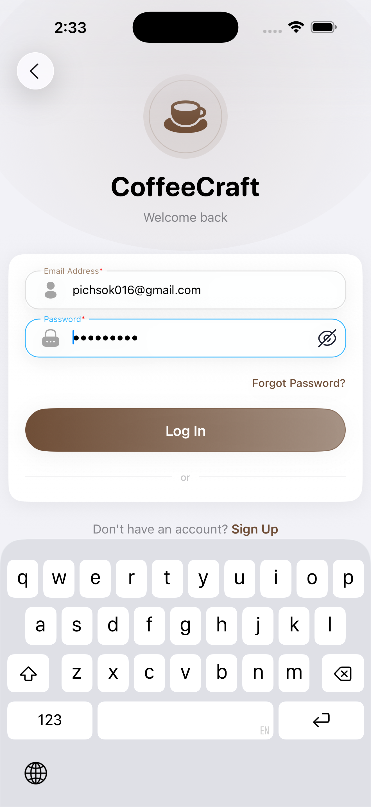
  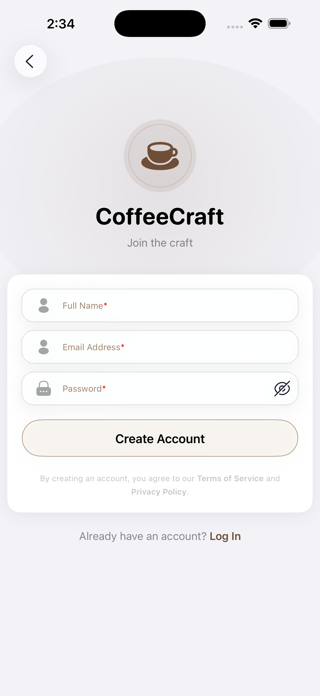
  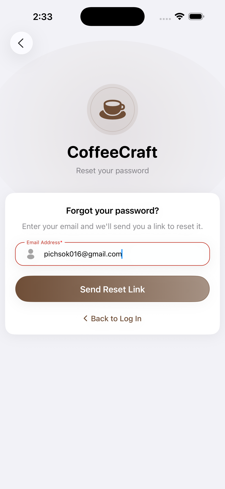
</p>
<p align="center">
  
  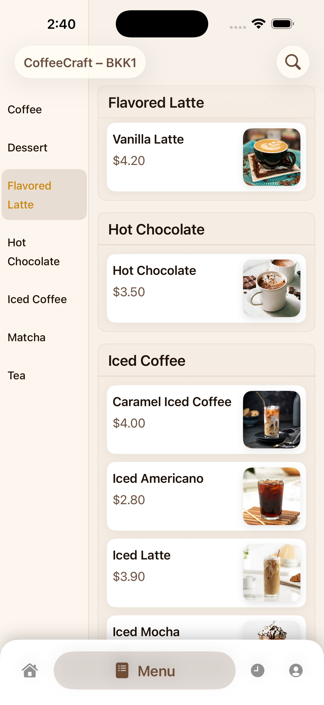
  
  
</p>
<p align="center">
  
  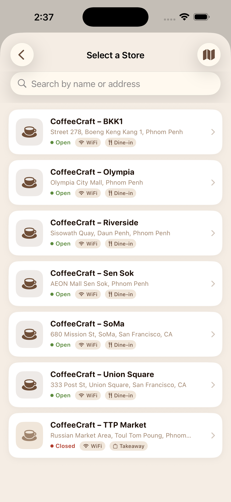
  
  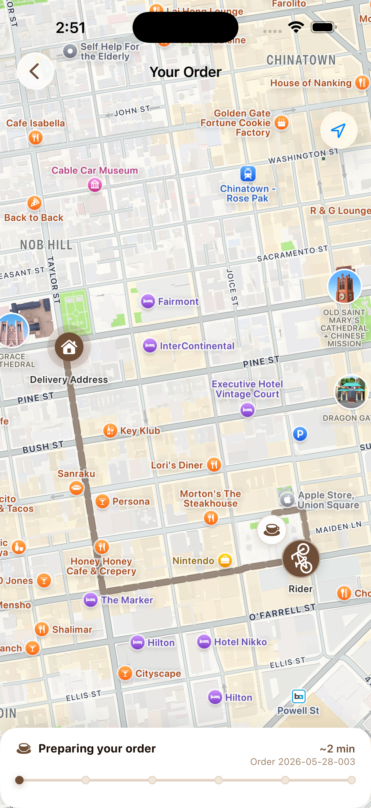
</p>
<p align="center">
  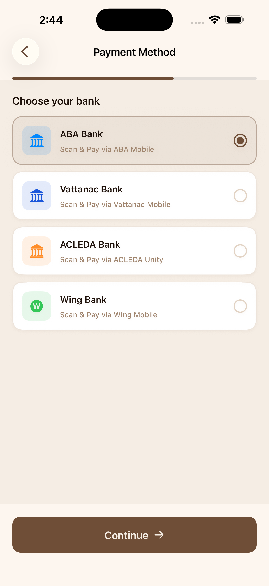
  
  
  
</p>
<p align="center">
  
  
  
  
</p>
<p align="center">
  
  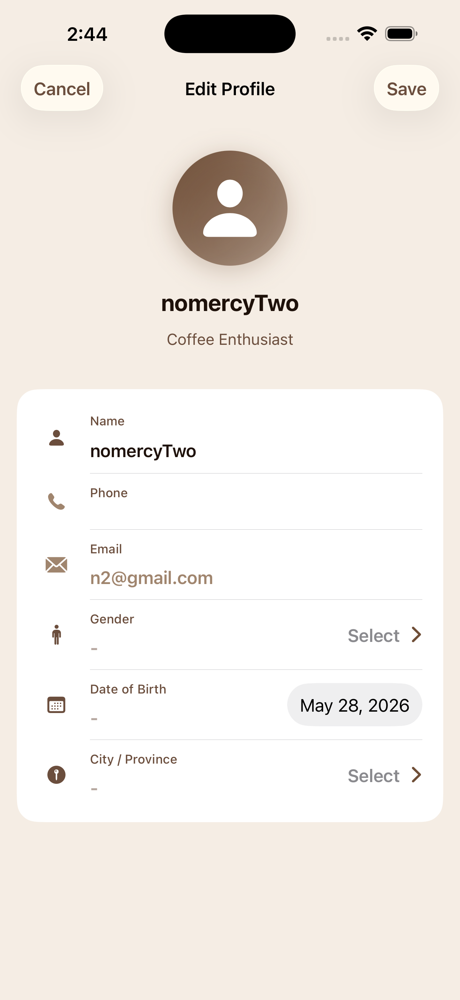
  
  
</p>
<p align="center">
  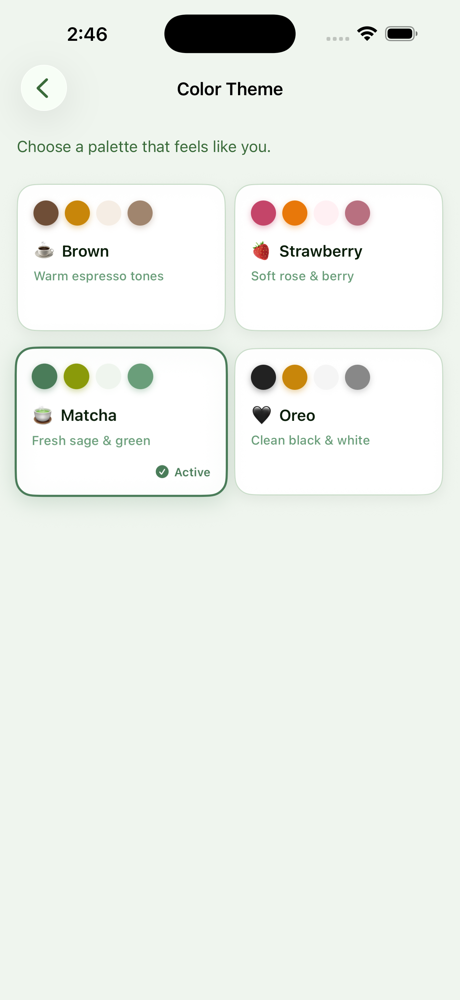
</p>

### 🛠 Admin / Manager

<p align="center">
  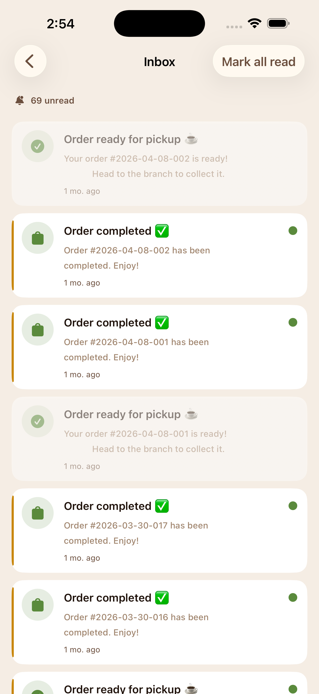
  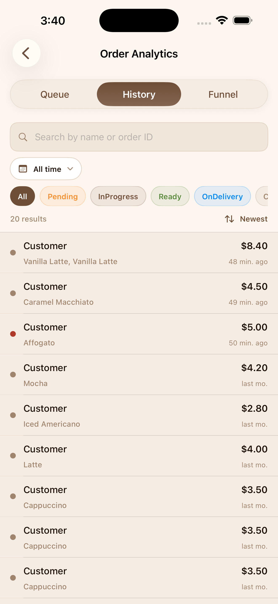
  
  
</p>
<p align="center">
  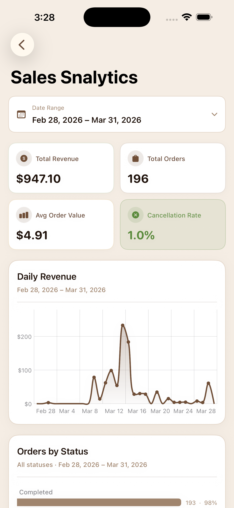
  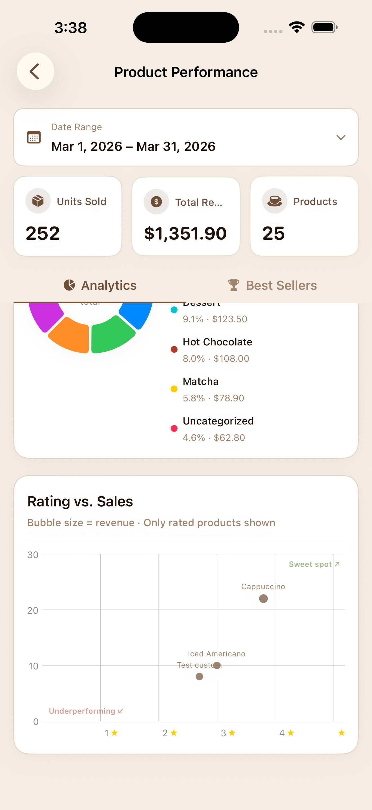
  
  
</p>
<p align="center">
  
  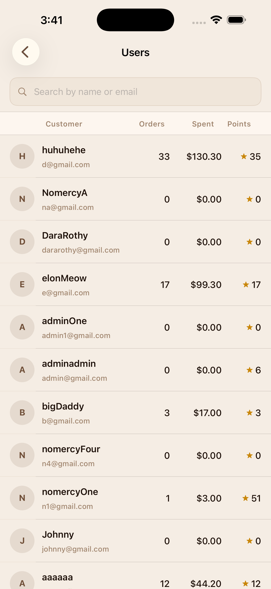
  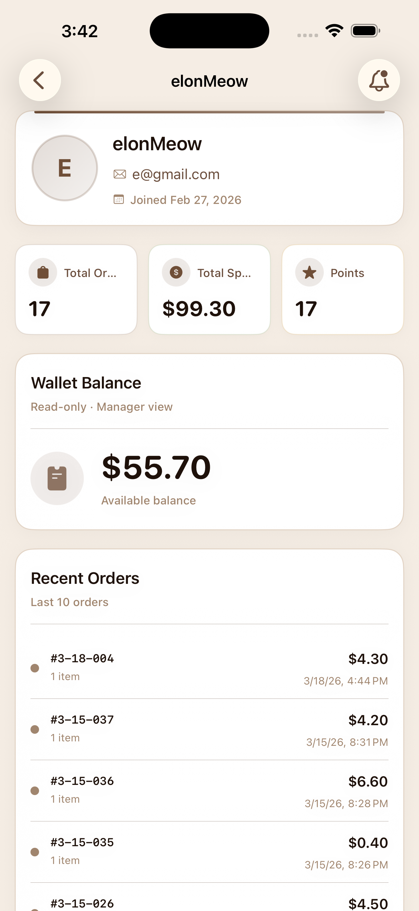
</p>

---

## ✨ Features

### 👤 Customer
- Browse menu with category filters and real-time availability
- Customize drinks (size, extras, options) with dynamic pricing
- In-app wallet — top-up, pay, and get refunds atomically
- Real-time order tracking: `Pending → Preparing → Ready → Completed`
- Cancel pending orders with instant wallet refund
- Proof-of-purchase verified reviews with star ratings
- Loyalty card management and point rewards
- Push notification deep-links to the Orders tab
- Store locator with MapKit and branch detail (hours, amenities, directions)

### 🛠 Manager
- Full order queue with status control and FCM push to customers
- Product CRUD — add, edit, delete, toggle availability
- Admin dashboard: revenue KPIs, order analytics, product performance, sales heatmap
- Review moderation — hide/unhide per product

---

## 🏗 Architecture

**Pattern:** MVVM + Repository, with `@EnvironmentObject` dependency injection.

```
View (SwiftUI)
  └─ ViewModel (@MainActor, @Published state)
       └─ Repository Protocol
            └─ Firebase Repository (Firestore / Firebase Auth)
```

<p>
  
  
  
  
</p>

ViewModels never import Firebase directly — they depend only on repository protocols, making them fully testable in isolation.

### Real-Time Data Strategy

| Strategy | Used For |
|---|---|
| Snapshot listeners | Products, wallet balance, transactions, inbox |
| Cursor-based pagination | Orders (pageSize = 5, listener covers all loaded pages) |
| `db.runTransaction()` | Wallet top-up, order payment, refund — atomic across multiple docs |

---

## 🛠 Tech Stack

<p>
  
  
  
  
  
  
  
  
</p>

---

## 🚀 Getting Started

### Prerequisites

- Xcode 15+, iOS 17 simulator or device
- A Firebase project with Auth, Firestore, and Cloud Messaging enabled

### Setup

```bash
git clone https://github.com/sokpichdev/CoffeeCraft.git
cd CoffeeCraft
open CoffeeCraft/CoffeeCraft.xcodeproj
```

1. Create a Firebase project at [console.firebase.google.com](https://console.firebase.google.com)
2. Add an iOS app with bundle ID `com.sokpich.CoffeeCraft.dev`
3. Enable **Email/Password** auth and create a **Firestore** database
4. Download `GoogleService-Info.plist`, rename it `GoogleService-Info-Dev.plist`, and place it in `CoffeeCraft/CoffeeCraft/`
5. Select the `CoffeeCraft-Dev` scheme and press `Cmd+R`

> `GoogleService-Info*.plist` is gitignored — never commit it.

### Firestore Rules (dev)

```js
rules_version = '2';
service cloud.firestore {
  match /databases/{database}/documents {
    match /{document=**} {
      allow read, write: if request.auth != null;
    }
  }
}
```

---

## 📦 Project Structure

```
CoffeeCraft/
├── Main/               # App entry, RootView, TabBarView, AppDelegate
├── Module/             # Feature modules (Auth, Home, Menu, Cart, Order, Wallet, ...)
├── Repository/         # Protocol + Firebase implementations per domain
├── Custom/             # 30+ reusable SwiftUI components
├── Extension/          # Color tokens, Font system, View helpers
├── Utilize/            # UserSession, AppLog, NetworkMonitor, Analytics
├── Constants/          # FirebaseKeys — all Firestore collection/field constants
└── docs/               # Firestore schema, architecture, theme, navigation docs
```

### Schemes

| Scheme | Purpose |
|---|---|
| `CoffeeCraft-Dev` | Local development |
| `CoffeeCraft-SIT` | System integration testing |
| `CoffeeCraft-UAT` | User acceptance testing |
| `CoffeeCraft` | Production |

---

## 🎨 Theme System

Four color palettes — **Brown**, **Strawberry**, **Matcha**, **Oreo** — with light/dark mode support. All colors are semantic tokens (`Color.accentPrimary`, `Color.bgPrimary`, etc.) that automatically adapt to the active palette and appearance. Persisted via `@AppStorage`.

---

## 🔒 Security Notes

- `GoogleService-Info*.plist` is gitignored — add your own for each environment
- All wallet mutations use Firestore transactions (atomic, no partial writes)
- Never commit `.env` or any credential files — they are blocked by `.gitignore`

---

<p align="center">
  ☕ <i>"First, solve the problem. Then, write the code. Then, drink more coffee."</i><br/><br/>
  <strong>Author:</strong> Sok Pich — iOS Developer &nbsp;|&nbsp; <a href="mailto:pichsok016@gmail.com">pichsok016@gmail.com</a>
</p>
